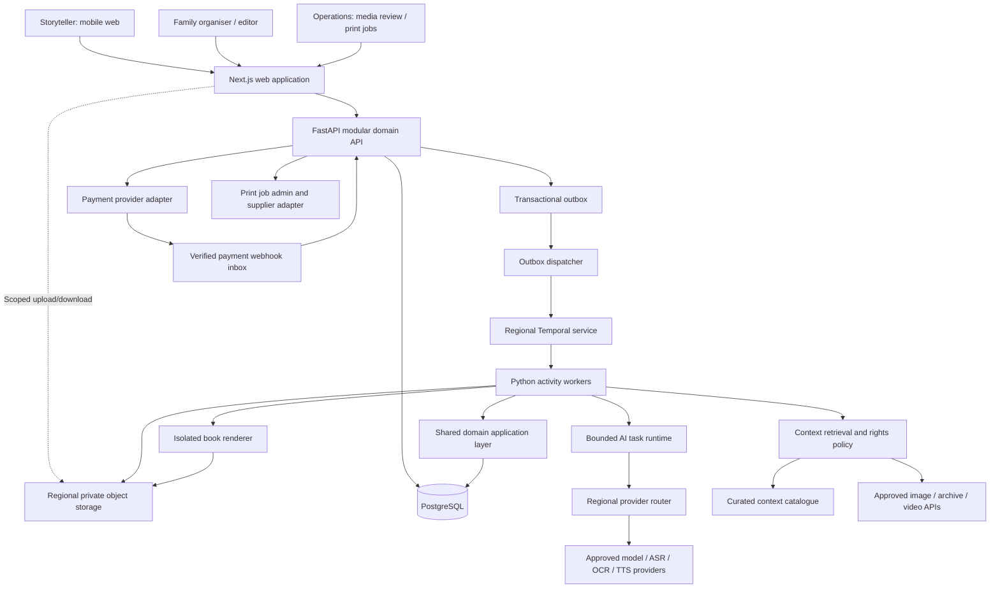
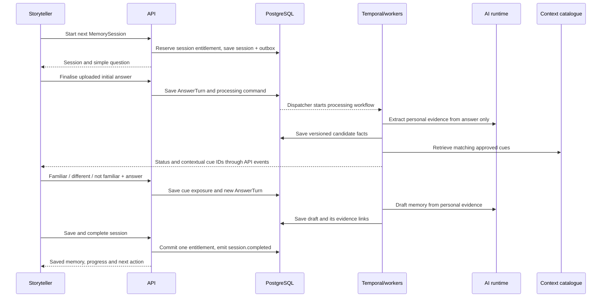

# Memory Spark — SaaS Architecture V1

**Status:** Proposed implementation architecture, not deployed software  
**Date:** 21 September 2026  
**Audience:** Founder, architect and implementation agents  
**Working name:** Memory Spark; no product-name or domain availability claim  
**Core scope:** Five free memory sessions → free mini memoir → paid continuation → reviewed digital edition → short-run printed book.

## 1. Decisions and boundaries

Build a modular monolith with durable workers, not a fleet of domain microservices. Use Next.js for the responsive web application, FastAPI for the domain API, PostgreSQL for authoritative business records, regional object storage for media, and Temporal for multi-step processing. Reuse advanced_aas behind a narrow, private AI-task interface when practical; do not put business rules inside the agent loop.

The browser talks to the API for business actions. It can upload/download private objects using API-issued scoped URLs, and can use approved payment pages and media embeds. It never receives model credentials, database service credentials or printer credentials.

The main durable unit is a **MemorySession**, also called a Memory Spark. It contains one primary topic, an initial answer, optional contextual cues, limited follow-up answers and a saved memory draft. It is not one LLM message.

A **Project** is the privacy and collaboration boundary and has one storyteller in V1. A storyteller may start independently or be invited by a relative. The payer, project organiser and storyteller may be different people. Payment alone does not grant access to private content.

Separate these responsibilities:

| Component | Owns | Must not own |
|---|---|---|
| FastAPI domain modules | Permissions, consent, usage, approvals, authoritative records | Unrestricted model autonomy |
| Temporal | Retries, process coordination, timers, waiting for approved actions | The sole permanent business database |
| AI runtime | Bounded question planning, extraction and drafting | Charging, permissions, publishing or supplier orders |
| PostgreSQL | Versioned records, ledger, events and source relationships | Large audio/video blobs |
| Object storage | Original media and immutable generated artifacts | Public-by-default family archives |
| Renderer | Layout of an approved manuscript snapshot | Inventing content or changing approvals |

No mandatory graph database, separate vector database, Kubernetes, real-time avatar, voice cloning or automated Taobao integration in V1. No requirement for LangGraph on top of Temporal and advanced_aas.

## 2. Logical system diagram



The diagram shows logical responsibilities, not one service per box. The domain API, dispatcher, workers and renderer may use the same Python repository/image with different commands. The TypeScript AI runtime is a separate process only because advanced_aas uses that language/runtime.

## 3. Physical deployment and regional isolation

Use one codebase with independently configured Australia and mainland-China deployment cells. A cell includes API, identity/session data, operational database, media storage, workflow persistence, workers, model routing, traces, backups and encryption keys.

```text
Australia cell                     Mainland-China cell
-----------------------------      -----------------------------
Regional web/API endpoints         Regional web/API endpoints
PostgreSQL + private objects       PostgreSQL + private objects
Temporal + workers                Temporal + workers
Approved processing providers     Approved processing providers
Payment merchant configuration    Payment merchant configuration
Regional traces and backups       Regional traces and backups

        No automatic private-project replication
```

Set `project.home_region` at creation through explicit onboarding and deployment policy. Do not infer it solely from language, citizenship or the payer's address. The routing layer need not hold raw profiles: project links can carry an opaque region/project locator. Invitations and identities remain scoped to the applicable cell.

A daughter in Australia can pay for a China-hosted project without copying the father's recordings into the Australia cell. Payer information is sent only as required by the selected payment provider. Reading a China-hosted memoir from Australia is a separate cross-border-access decision; “the database stayed in China” is not a complete assessment.

Use a policy record for each external processor: purpose, endpoint, processing location, permitted data classes, retention, training-use terms and approved project regions. A Sydney database does not make an overseas model call Australian-only processing. Provider fallback must stay inside the permitted processor set; otherwise pause the job.

This is a risk-reducing design, not a statement that every memoir must legally be hosted locally. Mainland launch needs review of the business/operator structure, applicable hosting and AI-service obligations, cross-border data flows, content labelling, payment onboarding and printing classification. An overseas company cannot assume that selecting a mainland cloud region resolves those matters. China PIPL addresses overseas services aimed at mainland individuals, sensitive information, cross-border provision and overseas representatives. Australian APP 8 provides cross-border disclosure obligations for APP entities; applicability and exceptions must be assessed. [S7][S8]

Deploy a fully tested cell first; do not describe the product as operational in both markets before the second has passed real-device, provider and compliance checks.

## 4. Application surfaces and identity

One web application provides three modes:

- **Storyteller:** large question, read-aloud, record/pause/playback, skip, context reaction, save, resume and delete.
- **Family:** uploads, draft corrections, timeline, family tree, chapter review, checkout and book preview.
- **Operations:** failed-job recovery, context rights review, supplier quotes/proofs, delivery tracking and support permissions.

Basic profile fields are approximate birth year, childhood place and preferred language. Ask occupation or later residences when useful, not as a long onboarding form. Setup questions are not primary memory sessions.

Use email/SMS login through a region-approved provider and scoped family invitations. Redeem an invitation with an explicit user action, not a GET that a messaging-app link preview might consume. Exchange the single-use, expiring token for an HttpOnly session. Do not put enduring authentication secrets in URLs or local storage. Sensitive downloads, new-device access and permission changes may require step-up verification.

Test Safari, Android browsers and relevant WeChat webviews. Detect supported recording formats rather than assuming every device records WebM/Opus; `MediaRecorder.isTypeSupported` provides capability detection but does not replace real-device testing. [S9] Provide audio-file upload and an “open in supported browser” route when recording is unavailable. Do not claim guaranteed background recording after a phone locks or the page is suspended.

PWA caching covers the application shell, not all private content. Any local recording buffer needs clear device-retention behaviour, deletion after confirmed upload and a warning on shared devices.

## 5. Domain modules

```text
identity_and_access/       accounts, sessions, invitations, grants
projects/                  storyteller, preferences, home region
consent/                   purposes, versioned notices, withdrawal
interviews/                sessions, prompts, turns, reactions
media/                     uploads, manifests, derivatives, scanning
context_catalogue/         archives, historical cards, rights review
memories/                  candidates, evidence, versions, uncertainty
people_and_timeline/       identities, aliases, relationships, dates
manuscripts/               outline, chapters, revisions, approvals
commerce/                  plans, orders, payment inbox, entitlements
publishing/                editions, exports, renderer, preflight
print_fulfilment/           suppliers, quotes, proofs, shipment
operations/                audit, outbox, repair, deletion, telemetry
```

Keep modules internally separated through application services and typed contracts. Workers call the same domain application layer rather than writing arbitrary tables. Agent tools use authorised internal endpoints or narrow function interfaces.

## 6. The interview loop

### 6.1 Session sequence



The actual dispatcher consumes an outbox table; the database does not spontaneously push into Temporal. SSE/polling is served through the API, not by a direct workflow-to-browser connection.

### 6.2 State transitions

```text
CREATED -> QUESTION_READY -> WAITING_FOR_ANSWER -> PROCESSING
    -> CONTEXT_READY -> WAITING_FOR_ANSWER -> PROCESSING
    -> DRAFT_READY -> COMPLETED

Any interactive stage -> PAUSED -> previous stage
Any processing stage -> RETRYABLE_ERROR -> PROCESSING
Skip before completion -> SKIPPED (release reservation)
```

Context and additional turns are optional. Re-entering `WAITING_FOR_ANSWER` never creates another primary-session charge. A project can have at most one active MemorySession in V1.

Ask the open question before the historical cue by default. Record all cue exposures, including their order and time, before accepting the next answer. Use prompts such as “Does this resemble your experience, or was yours different?” rather than asserting that an archival photograph depicts the narrator's actual street or workplace.

A rejected or unavailable cue must not block a session. Continue with a neutral follow-up. “I don't remember” is a valid answer and should not be treated as failure or poor cooperation.

### 6.3 AI task contracts

| Task | Inputs | Output | Hard boundary |
|---|---|---|---|
| PlanNextQuestion | Coverage, user-selected interests, approved memories, unanswered threads | One primary question or one follow-up | No entitlement or checkout authority |
| ExtractMemory | Versioned personal transcript plus explicit provenance | Candidate events, claims, names, uncertain dates | Cannot turn archival captions into biography |
| PlanContext | Coarse place/time/topic; no unnecessary personal identifiers | Search request and optional rationale code | No unrestricted browsing or private-data queries |
| DraftMemory | Selected claims and exact source references | Structured draft blocks with claim IDs | No unsupported scenes, dialogue or exact dates |
| ReviewDraft | Draft, evidence, glossary, restrictions | Unsupported/contradictory/uncertain spans | Not proof that history is objectively true |
| ComposeChapter | Approved memory versions, outline, permissions | Versioned chapter blocks | Cannot publish or overwrite approved revisions |
| TranslateChapter | Approved source chapter and name glossary | Linked target-language blocks | Preserve uncertainty and provenance |

Use Pydantic/JSON Schema validation and deterministic policy checks after model calls. Cap tool calls, output length, context volume and repair attempts. On schema failure, perform a bounded retry or show a recoverable error; never loop indefinitely.

### 6.4 advanced_aas reuse

Reuse the framework's provider interface, bounded tool execution, sessions and tracing only where those existing interfaces fit. This design assumes the framework capabilities previously described, not a fresh repository audit.

```text
Temporal activity
  -> AiTaskAdapter
      -> advanced_aas runtime (private TypeScript service)
          -> allowlisted region-aware tools
          -> approved model gateway
      <- structured candidate output
  -> schema / evidence / permission validation
  -> domain transaction
```

Expose narrow tools such as `get_project_interview_context`, `search_approved_context`, `get_authorised_evidence` and `propose_next_question`. Deny shell, arbitrary database writes, arbitrary file access, changing permissions, charging payments and submitting print orders. Do not make agent chat history the canonical memoir memory store.

## 7. Historical context and media retrieval

### 7.1 Two distinct retrieval domains

**Private retrieval** searches the project's own recordings, diaries, photographs, people and approved events. Apply project and item-level access filters before retrieval and again when resolving returned evidence.

**Public context retrieval** searches curated/licensed material by approximate place, period and topic. It receives the minimum needed query, not the family's complete interview transcript. A user's comment on a shared catalogue item remains project-private and never becomes shared catalogue metadata.

Start with SQL filters, a small editorially reviewed catalogue and ordinary search. Add pgvector only when measured retrieval quality justifies it. Keep embeddings a derived index, never the source of truth.

### 7.2 Ingestion and selection

```text
Approved provider / licensed collection
  -> metadata retrieval
  -> date/place/source verification
  -> rights and regional-use review
  -> approved ContextAsset
  -> published ContextPack

Live candidate search
  -> same policy checks
  -> approved result or pending review
  -> nothing shown if rights/identity cannot be resolved
```

Seed childhood home, school, food, work and migration topics for the pilot population. Avoid promising every village or decade is covered. Exact place/time matches are preferred; broader regional analogues must be labelled as such. Upload date is not automatically the date the historical scene was captured.

Show a small number of cues, not an endless feed. Fetch a cached pack first; dynamic search can enrich the interview without preventing the user from speaking. A regional-provider outage should degrade to an approved text card or no cue.

Wikimedia Commons requires file-specific licence and attribution checks; its reuse guide also cautions that supplied licensing information is not guaranteed and non-copyright restrictions may matter. [S4] YouTube's supported player API can cue segments where that platform and embed are available; embedding does not imply rights to download or print frames. [S5]

### 7.3 Rights are capabilities, not one enum

A single field such as `PRINT_ALLOWED` is too coarse. Use a reviewed policy with separate permissions:

```text
asset_id, source_url, creator, title, source_date
estimated_scene_date_range, location, attribution_text
licence_identifier, licence_url, rights_evidence_ref
can_embed, can_cache, can_transform, can_display_in_paid_app
can_include_in_download, can_print, allowed_regions
valid_until, reviewed_by, reviewed_at, policy_version
```

Unknown permissions default to false. Download rights, paid-app display rights, printing rights, cropping rights and video-frame rights are not interchangeable. Re-evaluate the rights policy when creating an edition. Store the evidence version used for that decision.

### 7.4 Recall provenance

Store a separate `CueExposure` and `CueReaction`. Linking a reaction to a photograph does not create a biography claim. A new factual statement after a cue has `elicitation=after_cue` and references the exposure; an initial answer has `elicitation=unaided`. These labels describe provenance, not whether a recollection is true or false.

Do not use generated historical pictures as authentic evidence. Do not infer political beliefs, sensitive life experiences or family relationships from a region/decade context pack. Historical material is a source of questions, not a replacement for the storyteller's account.

## 8. Canonical memory and evidence model

Use a relational evidence graph rather than adopting a graph database at launch.

```text
Recording -> TranscriptVersion -> TranscriptSegment -> EvidenceSpan
DiaryDocument -> DocumentVersion -> EvidenceSpan
Photo -> CaptionVersion / PersonTag -> EvidenceSpan

EvidenceSpan -> Claim -> MemoryEvent -> MemoryRevision
                                    -> ChapterRevision -> BookEdition
ContextAsset -> CueExposure -> AnswerTurn (elicitation provenance)
ContextAsset -> ContextSidebar (separate historical narration)
```

### 8.1 Example claim contract

```json
{
  "claim_id": "claim_001",
  "project_id": "project_001",
  "statement": "The narrator walked to primary school with an older brother.",
  "claim_type": "personal_recollection",
  "evidence": [
    {
      "source_kind": "transcript",
      "source_version_id": "transcript_v3",
      "segment_id": "segment_018",
      "start_ms": 82000,
      "end_ms": 96400,
      "char_start": 0,
      "char_end": 47
    }
  ],
  "date": {
    "original_expression": "when I first started school",
    "start": null,
    "end": null,
    "precision": "unknown"
  },
  "elicitation": "unaided",
  "cue_exposure_ids": [],
  "review_status": "narrator_confirmed",
  "visibility": "family",
  "contradicts_claim_ids": []
}
```

The IDs and offsets are illustrative. Implementations must validate actual source ranges and ensure all references belong to the authorised project. A `narrator_confirmed` status is not documentary proof. Keep extraction confidence, transcription confidence and human-review status as different concepts; some providers may not return calibrated confidence.

### 8.2 Identity, dates and disagreement

Store names, aliases, family titles and relationship edges separately. An expression such as “Second Uncle” may refer to several people. Create an unresolved mention instead of silently merging identities. Kinship edge attributes must support maternal/paternal ambiguity and non-biological relationships without forcing assumptions.

Retain the original date expression. Approximate years, ranges, lunar dates and unknown dates must remain representable. Calendar conversion, when offered, is a separate auditable transformation, not an invented exact date.

Keep differing family accounts as attributed claims. A relative can propose a correction but cannot silently replace the storyteller's account. Chapter generation can express uncertainty or differences rather than choose one unsupported “truth”.

Never silently fabricate quotation marks, dialogue, motivations, weather, sensory details or chronology to make a chapter more moving. An opt-in literary interpretation would need a separate product contract and is not V1.

### 8.3 Corrections and invalidation

Keep raw recordings and transcript versions immutable under the retention policy. A correction creates a new version; do not shift offsets in an old version. Track dependencies from evidence to memories, chapters and editions.

Changing a name, date, privacy setting or source marks affected drafts as stale. Family-approved wording is not overwritten automatically. A frozen edition remains immutable, but newly restricted content blocks future release/reprint and triggers appropriate access revocation. Already downloaded files or shipped books cannot be technically recalled.

## 9. Free first chapter, payment and package accounting

### 9.1 Separate commercial and technical accounting

```text
Commercial entitlement ledger:
  primary_sessions, translation_exports, print_credits (where sold)

Provider usage ledger:
  audio_seconds, model_input_tokens, model_output_tokens,
  search_requests, render_jobs, storage_bytes, provider_cost
```

Follow-up messages, clarifications and retries do not consume additional primary sessions. Disclose reasonable per-session processing limits before recording; do not unexpectedly turn a token cap into another question charge.

Use chapter entitlement as the default offer: primary sessions remain available while the first chapter is forming, and the first approved chapter is free. A support-granted post-chapter session is a separately recorded promotion, not hidden dynamic pricing or a judgement that a person's memory was insufficient.

### 9.2 Transactional counting

At session creation, lock the project's entitlement balance and reserve one available unit. Enforce one active session per project. At successful save/completion, atomically commit the unit and session state, then append an outbox event. Skip or terminal processing failure releases the reservation. Already incurred provider usage remains recorded for cost control.

Essential uniqueness rules:

```text
UNIQUE(project_id, session_id, operation='consume_primary_session')
UNIQUE(provider, provider_event_id)
UNIQUE(provider, provider_payment_id, grant_kind)
UNIQUE(command_id)
UNIQUE(edition_id, approved_content_hash)
```

These describe constraints; implement operation-specific rules using appropriate table design or partial unique indexes rather than copying them as SQL syntax.

After the first chapter is approved, a new primary session is blocked at the backend until a valid grant exists. Hiding the button is not security. Repeated browser requests and repeated workflow deliveries must not charge twice. Raw provider usage is recorded even when a pre-chapter session is abandoned; rate limits and bounded retries control abuse without using voice biometrics.

### 9.3 Preview and conversion

When the first chapter is approved, generate the free first chapter from saved memories. If the result is short, preserve it as a short honest chapter; do not pad it with invented experiences. Historical sidebars remain visually separate.

The preview contains a title, short narrative, source-linked voice clip, timeline where supported and suggested future topics. It can be corrected, read and downloaded without purchase. Existing recordings remain accessible subject to the disclosed retention policy.

The application shows checkout at this fixed product milestone. Do not let an emotion model decide when the user is most vulnerable, vary prices based on sensitive stories, or interrupt recording with a payment demand. The interviewer proposes future topics; the commerce module renders the offer.

### 9.4 Payment workflow

```text
Select server-defined plan version
  -> create Order with amount/currency and beneficiary project
  -> provider-hosted checkout
  -> signed webhook received into durable inbox
  -> verify merchant/order/payment status and amount
  -> transaction: paid order + one entitlement grant + outbox
  -> browser observes unlocked state
```

A success redirect is not payment evidence. Webhooks can arrive more than once and out of order; Stripe documents both behaviours and signature verification requirements. [S3] Persist the verified event before acknowledging delivery; processing can then be retried. Reconcile uncertain state against the provider's authoritative payment object.

Allow family-sponsored purchase using an opaque payment invitation. Payer identity does not automatically become a content-reader role. Separate digital-package orders from print orders so shipping, cancellation and refunds do not corrupt interview entitlements.

Use an abstract `PaymentProvider`. Australia can start with Stripe. Its current documentation lists WeChat Pay support for eligible Australian businesses; this does not mean every merchant, currency or in-WeChat checkout scenario is automatically supported. [S6] Mainland payment-provider selection remains conditional on the actual operator and approved merchant integration. Test the exact intended browser flow.

## 10. Recording, photos and diary ingestion

Create an `UploadSession` with expected MIME type, maximum size, checksum and object key. Upload private media using short-lived scoped URLs. The server validates actual type, size, checksum and recording duration before starting downstream processing.

For long or unreliable uploads, keep an ordered chunk manifest and acknowledged offsets. Browser media chunks are not necessarily independent playable files; reconstruct according to their container format and decode them before transcription. Do not simply transcribe arbitrary fragments as separate recordings.

States are `CREATED -> UPLOADING -> UPLOADED -> VALIDATED -> READY`, with quarantine/failure alternatives. Duplicate finalisation is idempotent. Orphaned uploads are cleaned under a documented retention policy.

Keep the original; create normalised audio for ASR and derivatives for playback. Preserve source time mapping. ASR uncertainty in names, places or dates creates a correction prompt. Unsupported dialects must be surfaced honestly, with family transcription or typed correction available.

Use typed text, diary documents and photo captions as first-class inputs to the same memory pipeline. Retrospective interview sessions consume the specified interview allowance; any paid diary/audio limits are separate, explicit plan fields. Photos, family tree and memories are available from the start in minimal form; do not delay photo support until after conversion if a photograph helps the first session.

For photographs, retain original/derivative separation, record rights confirmation, strip unnecessary location metadata from display derivatives and support approximate dates plus unresolved person tags. Do not add face recognition or automatic restoration to the V1 critical path. Photo layout and captioning are core; generative restoration is not.

Untrusted documents/media are scanned and processed in sandboxed workers with network and resource limits. OCR-derived text is untrusted content, never an instruction to the agent.

## 11. Manuscript, approval and publication

### 11.1 Stable structured manuscript

Use a constrained JSON manuscript model with blocks such as `Heading`, `NarrativeParagraph`, `DirectQuote`, `Photo`, `Caption`, `Timeline`, `FamilyTree`, `ContextSidebar` and `AudioLink`. Each block has a stable ID and references source claims or context sources as appropriate.

The AI drafts blocks, not PDFs. The editor modifies revisions, not arbitrary unversioned text. Parallel edits use revision IDs/optimistic concurrency; merging conflicts is an explicit user action, not last-write-wins.

Separate Chinese and English editions for V1 rather than demanding complex facing-page bilingual typesetting. Store a glossary of names and places and align translated blocks with their source revision. When a source changes, mark the translation stale.

### 11.2 Publication workflow

```text
Select approved memories and permitted media
  -> outline
  -> chapter drafting and evidence review
  -> family/storyteller edits
  -> translation where purchased
  -> freeze EditionSnapshot
  -> render outputs
  -> automated and visual preflight
  -> reader approves exact artifact hash
  -> publish digital edition / enable print order
```

The approving role is assigned explicitly by the storyteller/project policy. Payment, project administration and publication approval remain independent capabilities.

### 11.3 Outputs and rendering

Generate a private HTML reader, screen PDF, EPUB and downloadable archive. Use the same structured manuscript to create printer interior and cover files. Typst is the proposed PDF renderer; its current documentation describes PDF, PDF/A and PDF/UA export options, which should not be confused with a printer's PDF/X or colour-profile requirements. [S10]

Use an HTML/EPUB pipeline for EPUB, not a conversion from page screenshots. Pin renderer version, templates, approved font versions and asset hashes. Escape user text rather than interpolating it as executable template source. Run rendering without unrestricted network access.

Preflight checks include missing glyphs, image resolution at placed size, page dimensions, required bleed, binding/gutter space, pagination, table/tree overflow, required attribution, links, QR readability and the supplier's required PDF/colour specification. Use a print provider profile rather than universal hard-coded bleed and spine formulas. Flag uncertain compliance for operator review.

Do not insert private raw recordings or transcript attachments inside a file sent to the printer.

## 12. Printing under 100 copies

Use a manual supplier adapter for Taobao or other short-run printers. Supplier discovery and qualification are business operations, not unrestricted agent browsing/purchasing. V1 accepts quantities from 1 to 99 when supported by the chosen supplier.

```text
REQUESTED -> QUOTED -> PAYMENT_CONFIRMED -> PROOF_REQUESTED
 -> PROOF_RECEIVED -> CUSTOMER_APPROVED -> SUBMITTED
 -> IN_PRODUCTION -> SHIPPED -> DELIVERED

Alternative states: CANCELLED, REQUIRES_REVISION, SUPPLIER_ERROR
```

Store a supplier profile with contact method, supported formats, licensed/qualified status, data-handling terms, delivery countries and print requirements. A vendor profile is not proof that the output is exempt from applicable publication rules; classification is a launch/fulfilment review item.

A `PrintJob` references `edition_snapshot_id`, `interior_hash`, `cover_hash`, `proof_hash`, specifications, quantity, quote, recipient/delivery data and authorisation timestamps. A proof approval covers those exact files. Any modification invalidates approval and requires a new proof. Do not auto-submit merely because an agent says the book looks ready.

Give the supplier time-limited access to final files and necessary delivery details only. Record access and agreed deletion after fulfilment. Model supplier cancellation cutoffs; a shipped book cannot be revoked like a web link.

Print pricing should come from a confirmed specification and quote, not a fixed promise before page count and binding are known.

## 13. QR audio and archival ownership

QR codes must point to a stable application resolver, not an expiring signed object URL. The resolver checks the current access grant and generates a short-lived playback URL.

Private family authentication is the default. An optional book-holder access token requires explicit consent because anyone with the book can copy the code; issue high-entropy, scoped, revocable grants. Do not make every QR code public by default.

An archive manifest lists exported objects, versions and checksums. Include recordings, source transcripts, owned/redistributable photos, structured manuscript, PDFs/EPUB and attribution. Do not bundle external video or imagery lacking download rights.

Hosted links have an explicit service/retention term. The archive provides an offline fallback; it is not a promise of permanent hosted access. Revoking web access does not erase previously exported copies.

## 14. Durable execution and failure recovery

Do not create one never-ending agent loop for a person's entire life. Persist the project between bounded jobs.

Recommended workflows:

```text
ProcessAnswerTurn(answer_turn_id, expected_source_version)
ProcessMedia(upload_id)
BuildMemoryDraft(session_id, input_snapshot_id)
BuildFreePreview(project_id, snapshot_id)
BuildChapter(chapter_id, input_snapshot_id)
BuildEdition(edition_id)
FulfilPrintOrder(print_order_id)
ExportProject(export_request_id)
DeleteProject(deletion_request_id)
```

Temporal supports durable messages/Signals/Updates and wait conditions, useful for proof approval and other external decisions. [S1] Prefer bounded interview-processing workflows; a long print workflow can wait for explicit approvals. Continue-As-New is available when an unusually long workflow needs a fresh history, but is not a reason to store all memoir text in workflow history. [S2]

Pass IDs and compact status through workflows; retrieve sensitive content inside authorised activities. Do not log raw transcripts in workflow inputs or activity outputs. Where sensitive payloads are unavoidable, use appropriate encryption and retention controls.

All network/model/DB effects happen in activities, not nondeterministic workflow logic. Activities can retry; external actions therefore require idempotency. Pin input versions and persist successful AI output so a retry does not unnecessarily regenerate or overwrite an approved result. A provider timeout after remote processing may still incur duplicate provider cost if it lacks request idempotency; record and bound that risk rather than promise exactly-once billing upstream.

The application transaction writes domain state and an outbox command together. A dispatcher sends a deterministic workflow ID; it marks delivery only after acknowledgement and safely retries ambiguous deliveries. Domain-level idempotency remains necessary even if the orchestration layer deduplicates a start.

| Failure | Expected behaviour |
|---|---|
| Browser closes during upload | Resume acknowledged pieces; clearly report unuploaded local audio |
| Object uploaded but finalisation response lost | Idempotent finalise returns the same recording |
| API commits but orchestration call fails | Outbox retries without losing the command |
| ASR/model timeout | Bounded retry in permitted region; keep recording accessible |
| Context provider unavailable | Continue without cue; no lost trial unit |
| Duplicate save/payment webhook | One session consumption / one entitlement grant |
| Family edits while chapter builds | Snapshot/revision mismatch marks output stale |
| Permission revoked during job | Recheck before retrieval and before committing/releasing output |
| Worker finishes after project deletion starts | Tombstone/version guard rejects new output |
| Printer changes files | Invalidate approval and require new proof |

## 15. Database groups and important invariants

| Group | Initial tables |
|---|---|
| Identity/project | Account, Session, Project, ProjectMember, Invitation, ConsentRecord |
| Interview | MemorySession, Prompt, AnswerTurn, CueExposure, CueReaction |
| Source assets | UploadSession, UploadPart, MediaAsset, TranscriptVersion, TranscriptSegment, EvidenceSpan |
| Memory | Claim, ClaimEvidence, MemoryEvent, MemoryRevision, EventPerson, Person, PersonAlias, Relationship, Correction |
| Public context | ContextAsset, RightsPolicyVersion, ContextPack, ContextPackAsset |
| Manuscript | Chapter, ChapterRevision, BlockEvidence, EditorialApproval, EditionSnapshot, ExportArtifact |
| Commerce | PlanVersion, Order, PaymentEventInbox, EntitlementGrant, EntitlementReservation, UsageLedger |
| Printing | Supplier, PrintQuote, PrintOrder, PrintProof, Shipment |
| Operations | OutboxEvent, JobRecord, ProviderUsage, AuditEvent, DeletionRequest, AccessGrant |

Use UUIDs/opaque IDs and project-scoped foreign-key validation. Every private derived record belongs to a project, even when it is an embedding or thumbnail. Dates and kinship uncertainty must not be flattened into mandatory false precision. An evidence reference must resolve to a source version, not just a mutable filename.

Keep data/consent/role changes auditable. Avoid logging full personal stories in audit events; identifiers and action metadata usually suffice. Retain financial records only under their separately assessed requirements rather than deleting or retaining every record indiscriminately.

## 16. API boundary

All state-changing requests carry an application idempotency key where retries are plausible. Authorisation is checked per action and per referenced object.

The route examples below use the implementation's short `/v1` notation. The
CopyMe2 product-facing namespace is `/api/v1/memoir`; the runtime keeps
`/v1` as a compatibility adapter so existing clients and specification
fixtures continue to work. Domain entities remain product-neutral.

```text
POST   /v1/projects
POST   /v1/projects/{id}/invitations
POST   /v1/projects/{id}/consents
GET    /v1/projects/{id}/journey

POST   /v1/projects/{id}/memory-sessions
GET    /v1/memory-sessions/{id}
POST   /v1/memory-sessions/{id}/pause
POST   /v1/memory-sessions/{id}/skip
POST   /v1/uploads
POST   /v1/uploads/{id}/finalize
POST   /v1/memory-sessions/{id}/answers
POST   /v1/memory-sessions/{id}/cue-reactions
POST   /v1/memory-sessions/{id}/complete

GET    /v1/projects/{id}/memories
PATCH  /v1/memories/{id}                 # expected revision required
POST   /v1/projects/{id}/diary-entries
POST   /v1/projects/{id}/people
POST   /v1/projects/{id}/relationships
POST   /v1/projects/{id}/preview-builds

POST   /v1/projects/{id}/checkout
POST   /v1/webhooks/payments/{provider}
GET    /v1/projects/{id}/entitlements

POST   /v1/projects/{id}/chapter-builds
POST   /v1/chapters/{id}/approvals
POST   /v1/projects/{id}/editions
POST   /v1/editions/{id}/approvals
POST   /v1/editions/{id}/print-quotes
POST   /v1/editions/{id}/print-orders
POST   /v1/print-orders/{id}/proof-approvals

GET    /v1/jobs/{id}
GET    /v1/projects/{id}/events           # SSE with resume cursor
POST   /v1/projects/{id}/exports
POST   /v1/projects/{id}/deletion-requests
GET    /v1/audio-links/{opaque_id}        # access-controlled resolver
```

Long processing returns `202` with a job ID. UI progress uses persisted events with sequence IDs and reconnection cursors, plus polling fallback. Do not stream hidden reasoning; show statuses such as “Recording saved”, “Preparing your memory” and “Draft ready”. SSE disconnection never cancels accepted backend work.

Typed result examples:

```text
NextQuestionResult {question_id, session_id, text, read_aloud_asset_id?}
ContextCueResult   {asset_id, label, attribution, match_scope, allowed_actions}
MemoryDraftResult  {revision_id, blocks, evidence_links, review_flags}
JobAccepted       {job_id, status, status_url}
```

OpenAPI-generated frontend contracts reduce divergence. The agent should not invent API routes or bypass these boundaries.

## 17. Security, privacy and deletion

The storyteller controls whether a memory is private, family-visible, included in the digital edition or included in print. Project membership alone is not always enough. Use capability checks and per-object visibility; database RLS can provide defence in depth, but privileged backend credentials must not bypass application checks accidentally.

Keep personal and public retrieval stores logically distinct. Scraped pages, image captions, OCR text and transcripts are untrusted data and cannot instruct tools to send secrets, alter access or purchase services. Restrict outbound destinations; defend retrieval/render workers against SSRF, malicious files and oversized decompression.

Use region-scoped secrets, TLS, encrypted storage, backup encryption, short-lived downloads, separate admin access and audit trails. Do not train models on family content by default. Provider contracts and settings must support the stated promise; a checkbox in your UI does not alter a provider's retention policy.

Deletion is a workflow: revoke grants, reject new work, stop/cancel pending tasks, delete active media/derivatives/indexes/exports, request processor deletion where applicable, expire caches and record completion. Backups follow a disclosed retention schedule and deletion tombstones must be reapplied on restore. Record exceptions for legally retained payment data. Do not claim instant deletion from every backup or printer system.

Treat living third-party allegations and sensitive passages as review items. Allow skip, pause and exclusion without pressure. The app is a storytelling product, not a diagnosis of memory health or a factual certification of every recollection.

## 18. Observability and evaluation

Use regional OpenTelemetry traces and redacted AI evaluation records. A self-hosted/approved Langfuse deployment can support model task evaluation where compatible with residency and retention policy. Full production transcripts are not required for routine telemetry.

Product events:

```text
profile.completed
memory_session.started
answer.saved
cue.shown
cue.reacted
memory_session.completed
preview.ready
preview.downloaded
checkout.started
order.paid
paid_session.completed
edition.approved
print_order.delivered
```

Report the funnel using explicit definitions: unique projects approving a first chapter; previews actually opened; paid package orders after the free chapter; repeat recording after payment; approved editions; delivered print orders. Track refunds and abandonment too. Do not optimise conversion solely through emotional-content analysis.

AI evaluations cover question relevance, repeated/leading questions, transcript name/date handling, false merging of relatives, uncertain-date preservation, source-to-claim entailment, historical-context leakage into first-person narrative, unsupported direct quotes, translation drift and privacy leakage. Evaluate regional provider combinations on consented or synthetic fixtures and native-speaker review.

Proposed pilot quality gates, not measured claims:

- Every released factual narrative block has resolvable internal evidence links.
- Every shown external cue has an approved source/rights policy and historical-reference label.
- No duplicate entitlement charges in retry/concurrency tests.
- No cross-project evidence retrieval in adversarial tests.
- No unapproved artifact reaches the printer.
- P95 simple API operations under 500 ms, excluding media upload and AI processing.
- P95 saved-answer-to-first-result under 30 seconds for a defined two-minute test recording, subject to measured provider performance.

Source links alone do not prove entailment; combine automated checks with sampled human review. Recording persistence and recovery deserve higher operational priority than decorative cue availability.

Track real provider cost per completed free preview, per paid project and per approved edition. Use smaller tasks/models where evaluation supports them, cache public context, and regenerate only affected chapters.

## 19. Repository and local development

```text
memoir-platform/
  apps/
    web/                         # Next.js storyteller/family/ops
    api/                         # FastAPI routes and auth boundary
    worker/                      # Temporal workers and activities
    agent-runtime/               # narrow advanced_aas adapter
  packages/
    domain/                      # Python application modules
    contracts/                   # JSON Schema / generated API types
    ai-tasks/                    # prompts, schemas, evaluation fixtures
    book-templates/              # structured templates and renderer config
  infra/
    compose.yaml
    migrations/
    regions/au/
    regions/cn/
  tests/
    domain/
    workflow_replay/
    end_to_end/
    security/
    ai_evaluations/
    print_preflight/
  docs/
    architecture/
    decisions/
    operations/
```

One Compose command starts the application, worker, agent runtime, PostgreSQL, an object-storage emulator and Temporal for development. Use fake payments and licensed/synthetic fixtures. Production payment submission and supplier submission must fail closed without the correct environment and explicit approval. Do not use a development Temporal server as a production durability guarantee.

For an early production cell, use container deployment with managed PostgreSQL/object storage and a properly operated regional Temporal service; workers scale independently from the API. The same worker image can use separate queues for answer processing, publishing and maintenance. Give interactive interviews priority over bulk rendering.

Do not make the founder's local workstation the sole production archive. Backups and restore rehearsals must include database-object consistency, entitlement state, encryption keys, in-flight jobs and deletion tombstones.

## 20. Delivery sequence and acceptance

### Slice 1 — One real memory

Profile and consent; one voice/text answer; one relevant approved context cue; follow-up; source-backed draft; pause/resume; playback and correction. Include a real photo upload and a minimally editable person record.

**Acceptance:** On representative mobile devices, an interrupted recording/upload can be recovered to the extent already persisted, no unsupported cue is shown, and the approved text links to the correct audio/transcript version.

### Slice 2 — Free first chapter and real commerce

Five-session ledger, free mini memoir, preview download, package checkout, verified webhooks and paid continuation. Include one family-sponsored purchase.

**Acceptance:** Replayed webhooks do not grant twice; pre-chapter sessions remain available; a post-chapter session is correctly gated; payment does not change project access; free artifacts remain downloadable.

### Slice 3 — Complete digital memoir

Diary/photo ingestion, basic three-generation relationships, timeline, chapters, source review, optional translation, private HTML, PDF/EPUB and source archive.

**Acceptance:** A corrected name invalidates affected drafts/translation without silently overwriting approved edits; an edition is reproducible from its frozen snapshot.

### Slice 4 — One approved print order

One supplier profile, quote, exact-file proof approval, final print package and tracking. Start with one supported trim/binding template per supplier.

**Acceptance:** A real small-run proof is inspected; modified files invalidate approval; the supplier never receives raw interview audio. The customer can order 1–99 copies only within the supplier's supported range.

### Slice 5 — Second regional launch and operational hardening

Second deployment cell, regional payments/providers, local device/network tests, compliance review, restore/deletion tests and cost/concurrency measurements.

**Acceptance:** The deployment meets its declared processing-location policy and can complete the same end-to-end journey without silently routing private data to the other cell.

Do not replace these slices with separate “all AI first”, “all family tree first” or “all UI first” projects. The commercial hypothesis is the complete pre-chapter-to-free-first-chapter-to-paid-book journey.

## 21. Architectural decision record

| Decision | Chosen approach | Reason |
|---|---|---|
| Backend organisation | Modular monolith plus workers | Faster delivery and explicit domain boundaries |
| Interview interaction | Asynchronous recorded turns | Pause/resume and lower runtime complexity |
| Memory authority | PostgreSQL evidence/claim/version model | Auditability, corrections and reliable publication |
| Context retrieval | Curated first; approved dynamic candidates | Rights, relevance and predictable fallback |
| Agent framework | Reuse advanced_aas behind task adapter | Reuse without surrendering business authority |
| Durable processes | Temporal, bounded workflows | Recovery and explicit human decision waits |
| Trial | Five primary sessions, atomic accounting | Understandable offer and retry-safe charging |
| Monetisation | Versioned project package plus print order | Separates generation value from fulfilment cost |
| Regional strategy | Independent cells and processor allowlists | Reduces accidental cross-border transfers |
| Book model | Structured manuscript and immutable edition | Multi-format rendering and exact-file proof approval |
| Printing | Human-operated supplier adapter | End-to-end fulfilment without fragile automation |
| Expansion | No graph DB / native apps / live avatar initially | Avoids unrelated complexity before validation |

## 22. Open launch dependencies

These do not block writing the core application but must be resolved before making live-service commitments: mainland operator/hosting and AI-service requirements; processor retention and regional permissions; actual merchant eligibility; media licences for paid display/download/print; dialect ASR quality; exact supplier PDF requirements and classification; retention/support/refund terms; and acceptable recording behaviour on target WeChat/browser versions.

No vendor has been contacted, no account eligibility has been confirmed and no production performance has been measured for this design.

## Technical and regulatory sources

Sources were consulted on 21 September 2026. Vendor behaviours below are grounded in official documentation; proposed limits, data models, deployment choices and milestones are design recommendations, not vendor guarantees. The source list is not an exhaustive legal opinion or compliance checklist.

[S1] Temporal, Python workflow message passing — Signals, Updates and wait conditions.  
`https://docs.temporal.io/develop/python/workflows/message-passing`

[S2] Temporal, Python Continue-As-New — fresh execution history for continuing workflows.  
`https://docs.temporal.io/develop/python/workflows/continue-as-new`

[S3] Stripe, Webhooks — duplicates, ordering, durable handling and signature verification.  
`https://docs.stripe.com/webhooks`

[S4] Wikimedia Commons, Reusing content outside Wikimedia — licence verification, attribution and other rights.  
`https://commons.wikimedia.org/wiki/Commons:Reusing_content_outside_Wikimedia`

[S5] Google, YouTube IFrame Player API — official embedded player and cueing controls.  
`https://developers.google.com/youtube/iframe_api_reference`

[S6] Stripe, WeChat Pay — country/currency eligibility and integration behaviour.  
`https://docs.stripe.com/payments/wechat-pay`

[S7] Cyberspace Administration of China, Personal Information Protection Law — scope, sensitive information and cross-border provisions.  
`https://www.cac.gov.cn/2021-08/20/c_1631050028355286.htm`

[S8] OAIC, APP 8 cross-border disclosure guidance — applicability, obligations and exceptions.  
`https://www.oaic.gov.au/privacy/australian-privacy-principles/australian-privacy-principles-guidelines/chapter-8-app-8-cross-border-disclosure-of-personal-information`

[S9] MDN, MediaRecorder.isTypeSupported — runtime recording-format detection.  
`https://developer.mozilla.org/en-US/docs/Web/API/MediaRecorder/isTypeSupported_static`

[S10] Typst, PDF export reference — supported PDF, archival and accessibility output profiles.  
`https://typst.app/docs/reference/pdf/`
